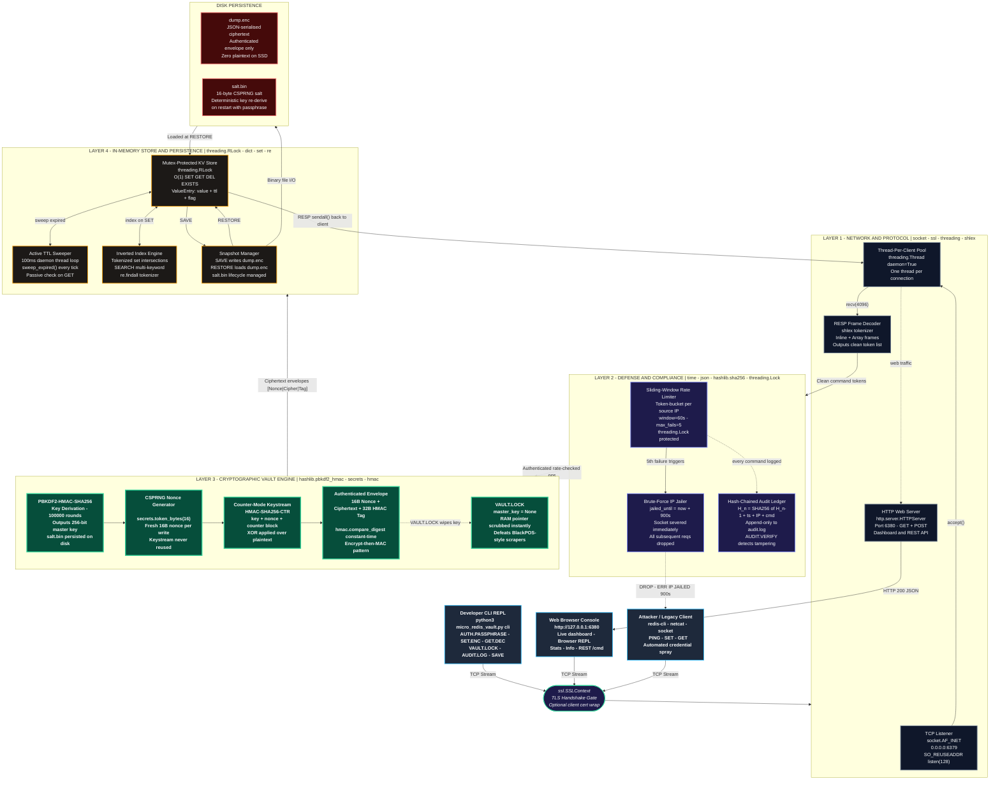

# Micro-Redis-Vault — Definitive Architecture

## Mermaid Diagram (paste into any Mermaid renderer or IcePanel)

---

## Python Class Map

| Layer | Stdlib Modules | Python Class |
|:---|:---|:---|
| Network & Protocol | `socket`, `ssl`, `threading`, `shlex`, `http.server` | `MicroRedisVaultServer`, `RespParser` |
| Defense & Compliance | `time`, `json`, `hashlib`, `threading.Lock` | `RateLimiter`, `AuditLedger` |
| Cryptographic Vault | `hashlib.pbkdf2_hmac`, `secrets`, `hmac` | `CryptoEngine` |
| In-Memory Storage | `threading.RLock`, `dict`, `set`, `re` | `StorageEngine`, `ValueEntry` |

## Full Command Reference

| Command | Routed Through | Description |
|:---|:---|:---|
| `AUTH.PASSPHRASE <pass>` | Shield → Vault | Derives 256-bit key via PBKDF2 (100k rounds) |
| `SET.ENC <key> <val>` | Vault → Store | Encrypts with HMAC authenticated envelope in RAM |
| `GET.DEC <key>` | Store → Vault | Decrypts and returns plaintext value |
| `VAULT.LOCK` | Vault | Scrubs master key pointer from RAM |
| `SET / GET / DEL / EXISTS / KEYS` | Store | Standard Redis-compatible plaintext ops |
| `TTL / EXPIRE` | Store | Key expiry swept every 100ms |
| `SEARCH <word>` | Store | Inverted index full-text search |
| `SAVE` | Store → Disk | Writes authenticated ciphertext to dump.enc |
| `RESTORE` | Disk → Store | Loads and decrypts snapshot from dump.enc |
| `AUDIT.LOG [n]` | Shield | Returns last N hash-chained ledger entries |
| `AUDIT.VERIFY` | Shield | Verifies SHA-256 chain — catches any tamper |
| `FLUSHALL / FLUSHDB` | Store | Wipe all keys from in-memory store |
| `INFO` | Server | Runtime stats, version, key count, uptime |
| `PING` | Network | Liveness probe — returns +PONG |
