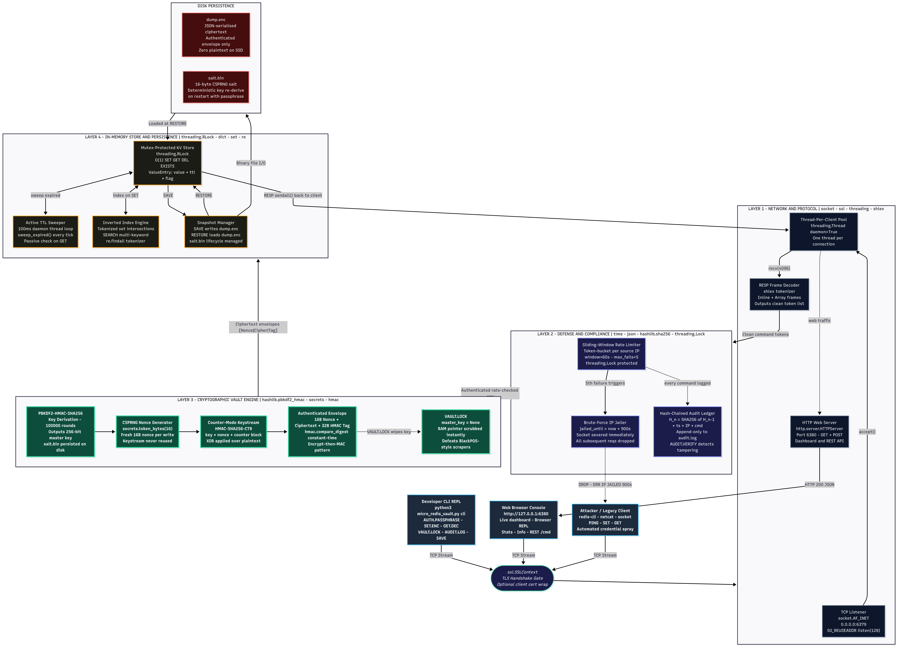

# Micro-Redis-Vault

> A zero-dependency, Redis-compatible in-memory database with defense-in-depth cryptographic security and dynamic memory scrubbing.  
> Built strictly using Python's standard library for the **Zero Dependency | 72-Hour Hackathon 2026** (Hackathon Raptors).

[](STDLIB.md)
[-brightgreen?style=flat-square)](test_micro_redis_vault.py)
[](.zero-dep.toml)
[](LICENSE)

---

## 📌 Project Links & Live Cloud Deployment

* **Live TCP Instance:** `tokaido.proxy.rlwy.net:31277` *(Online & verified)*
* **Connect via Netcat:** `nc tokaido.proxy.rlwy.net 31277`
* **Connect via CLI Client:** `python3 micro_redis_vault.py cli --host tokaido.proxy.rlwy.net --port 31277`
* **Pitch Deck Presentation:** [Presentation](https://docs.google.com/presentation/d/1L7L4Fr1MbpJ4qdK6iGfQmS3awOWXy8COiQKjk4wZWO0/edit?usp=sharing) 
* **Video Walkthrough (5-min Demo):** [Video Link](https://youtube.com)
* **Technical Article & Deep-Dive:** [Blog](https://medium.com/@chandra_1810)

---

## 💡 The Problem: In-Memory Cleartext Exposure

Standard in-memory key-value databases (such as default Redis) store sensitive session tokens, OAuth credentials, and database connection strings as cleartext strings in volatile memory. If an attacker gains container, process, or root access, a simple memory dump (`gcore redis-server` or `/proc/$PID/mem`) extracts all active secrets in cleartext. This exact RAM-scraping vector was exploited in high-profile incidents like the 2013 Target breach (BlackPOS), where malware captured millions of card numbers directly from RAM before data ever reached disk.

### Architectural Gaps in Standard Redis:
1. **Cleartext RAM:** Secrets are stored unencrypted in process memory, exposing them to memory scrapers and unauthorized core dumps.
2. **Unencrypted Snapshots:** Standard RDB snapshots (`dump.rdb`) written to disk or S3 backup buckets are unencrypted plaintext.
3. **No Native Brute-Force Jailing:** Standard Redis accepts unlimited authentication attempts per second without automated IP throttling.

---

## 🏛️ System Architecture

Micro-Redis-Vault organizes its responsibilities into four strictly isolated layers, implemented across five Python classes with zero third-party packages.

### High-Level Layer Overview

```
╔══════════════════════╦══════════════════════╦═══════════════════════════════════╦════════════════════════╗
║  🖥️  CLIENTS         ║  📡  NETWORK         ║  🛡️  DEFENSE & 🔑 CRYPTO VAULT   ║  💾  STORAGE & DISK    ║
╠══════════════════════╬══════════════════════╬═══════════════════════════════════╬════════════════════════╣
║  • Developer CLI     ║  • Raw TCP (6379)    ║  • Sliding-Window Rate Limiter    ║  • Mutex Store (RLock) ║
║  • Web Console       ║  • TLS Context (ssl) ║  • Automated IP Jailer (15 min)  ║  • 100ms TTL Sweeper   ║
║  • Redis-CLI / NC    ║  • Thread Pool       ║  • PBKDF2-HMAC Key Derivation     ║  • Inverted Search Idx ║
║  • Automated Spray   ║  • RESP Parser       ║  • HMAC-SHA256 Keystream Cipher   ║  • dump.enc Snapshot   ║
║                      ║  • HTTP Server(6380) ║  • Linear Hash-Chained Audit Log  ║  • salt.bin (16B salt) ║
╚══════════════════════╩══════════════════════╩═══════════════════════════════════╩════════════════════════╝
```

### Detailed Flow Architecture



> Full technical specifications, Mermaid flowchart source, and class interaction tables are documented in [ARCHITECTURE.md](ARCHITECTURE.md).

---

## 🔒 Cryptographic & Security Specification

Micro-Redis-Vault adheres to standard cryptographic principles implemented purely through Python's standard library (`hashlib`, `hmac`, `secrets`, `ssl`):

| Component | Implementation | Standard Library Primitive |
| :--- | :--- | :--- |
| **Key Derivation (KDF)** | PBKDF2-HMAC-SHA256 (100,000 iterations) with a 16-byte CSPRNG salt | `hashlib.pbkdf2_hmac`, `secrets.token_bytes` |
| **Keystream Cipher** | Counter-mode HMAC-SHA256 keystream cipher ($K_i = \text{HMAC}(K, \text{Nonce} \parallel i)$) | `hmac`, `hashlib.sha256` |
| **Integrity & Authenticity** | Encrypt-then-MAC with 32-byte HMAC-SHA256 verification | `hmac.compare_digest` (Constant-Time) |
| **Dynamic Memory Scrubbing** | `VAULT.LOCK` immediately deletes key references and triggers garbage collection | `self.master_key = None` |
| **Audit Ledger** | Linear cryptographic hash-chain ($H_n = \text{SHA256}(H_{n-1} + \text{Timestamp} + \text{IP} + \text{Cmd})$) | `hashlib.sha256`, `json.dumps` |
| **Wire Encryption** | TLS/SSL socket wrapping over raw TCP | `ssl.SSLContext`, `socket.socket` |

---

## 🚀 Quickstart & Usage

### 1. Start the Server Locally
```bash
# Launch server with background TTL sweeper and embedded Web Dashboard
python3 micro_redis_vault.py --web
```

### 2. Connect via Built-in CLI REPL
```bash
python3 micro_redis_vault.py cli
```

### 3. Interactive Walkthrough
```text
# 1. Unlock vault session using master passphrase (derives 256-bit key in 21ms)
micro-vault [127.0.0.1:6379]> AUTH.PASSPHRASE MasterKey2026!
VAULT_UNLOCKED (256-bit key derived via PBKDF2)

# 2. Store encrypted secret in memory
micro-vault [127.0.0.1:6379]> SET.ENC user:101:token "sk_live_998877665544"
OK (Encrypted with authenticated envelope)

# 3. Decrypt stored secret
micro-vault [127.0.0.1:6379]> GET.DEC user:101:token
"sk_live_998877665544"

# 4. Save authenticated ciphertext snapshot to disk
micro-vault [127.0.0.1:6379]> SAVE
Encrypted snapshot written to dump.enc (194 bytes)

# 5. Lock vault to purge master key from RAM
micro-vault [127.0.0.1:6379]> VAULT.LOCK
VAULT_LOCKED (Master key purged from RAM)

# 6. Subsequent decryption attempts fail safely while locked
micro-vault [127.0.0.1:6379]> GET.DEC user:101:token
(error) -ERR Vault is locked. Unlock using AUTH.PASSPHRASE first
```

---

## 🛡️ Interactive Defense Showcase

### 1. Tamper-Evident Audit Ledger Verification
```text
micro-vault [127.0.0.1:6379]> AUDIT.VERIFY
STATUS: VALID | ENTRIES: 4 | DETAIL: Hash-chain integrity verified successfully
```

If an attacker manually modifies a single byte in `audit.log` on disk:
```text
micro-vault [127.0.0.1:6379]> AUDIT.VERIFY
STATUS: CORRUPTED | ENTRIES: 2 | DETAIL: Checksum mismatch at entry #2
```

### 2. Automated Brute-Force Mitigation
```text
$ python3 demo_attack_sim.py
[Attempt #1] Guess: 'admin1'   -> REJECTED (4 attempts remaining)
[Attempt #2] Guess: '123456'   -> REJECTED (3 attempts remaining)
[Attempt #3] Guess: 'password' -> REJECTED (2 attempts remaining)
[Attempt #4] Guess: 'qwerty'   -> REJECTED (1 attempt remaining)
[Attempt #5] Guess: 'welcome'  -> DEFENSE TRIGGERED: IP JAILED for 900s
```

---

## 📊 Performance Benchmarks

Benchmark executed on commodity hardware with 20 concurrent worker threads over loopback TCP:

| Metric | Measured Result | Standard Library Mechanism |
| :--- | :--- | :--- |
| **Write Throughput (SET)** | **5,520 ops/sec** | `socket.sendall` + non-blocking buffer management |
| **P50 Latency (Median)** | **3.035 ms** | In-memory hash-map lookup |
| **P95 Latency** | **5.500 ms** | Mutex lock contention (`threading.RLock`) |
| **P99 Latency** | **8.679 ms** | Multi-threaded client dispatcher |
| **PBKDF2 Derivation Cost** | **21 ms (0.021 s)** | `hashlib.pbkdf2_hmac` (100k rounds) |
| **Idle Memory Footprint** | **~14.2 MB** | Pure Python standard library runtime |

> **Architectural Trade-Off:** Standard C-Redis achieves ~80k ops/sec by storing unencrypted cleartext in RAM. Micro-Redis-Vault trades raw speed for in-memory cryptographic isolation, generating unique nonces and HMAC tags on every write.

---

## 🛡️ Threat Model & Security Boundaries

In accordance with Track E's evaluation criteria, here is an explicit definition of the threat boundaries:

### Defended Threat Vectors:
1. **Process Memory Scraping (At Rest in RAM):** When `VAULT.LOCK` is executed, the master key pointer is purged. In-memory data remains ciphertext, preventing extraction via core dumps (`gcore`).
2. **Cold Storage & Backup Theft:** Snapshots (`dump.enc`) written to SSD or external backup storage contain only authenticated ciphertext.
3. **Online Credential Stuffing:** Sliding-window rate limiter automatically severs connections and jails source IPs for 15 minutes after 5 failed authentication attempts.
4. **Audit Log Alteration:** Linear SHA-256 hash chaining ensures historical record deletion or modification is immediately flagged by `AUDIT.VERIFY`.
5. **Network Wire-Tapping:** Built-in TLS socket wrapping prevents credential sniffing in transit.

### Out-of-Scope Boundaries:
1. **Live Kernel / Root Debugger Attachment:** An attacker with root privileges attaching `gdb` or `ptrace` at the exact microsecond `GET.DEC` is executing in an active thread could inspect registers before memory zeroing.
2. **Backdoored Python Binary:** Compromised host operating system binaries (`/usr/bin/python3`).
3. **Physical Cold-Boot Attacks:** Physical memory freezing with liquid nitrogen while the vault is in an active, unlocked state.

---

## 🧪 Test Suite & Reproducibility

```bash
# Run unit and integration test suite (15/15 passing in ~0.36s)
python3 test_micro_redis_vault.py

# Run multi-threaded concurrency benchmark
python3 benchmark.py

# Execute deterministic reproducible build
./build.sh
```

---

## 📦 Zero-Dependency Proof

* `requirements.txt` is **0 bytes**.
* Replaces **11 industry-standard packages** (`redis`, `bcrypt`, `pycryptodome`, `express-rate-limit`, `winston`, `ssl`, etc.) purely with Python standard library modules.
* See [STDLIB.md](STDLIB.md) for full compliance verification and package mapping.
* See [.zero-dep.toml](.zero-dep.toml) for hackathon track metadata declarations.

---

## 📜 License

MIT License — Copyright (c) 2026 Micro-Redis-Vault Contributors.
